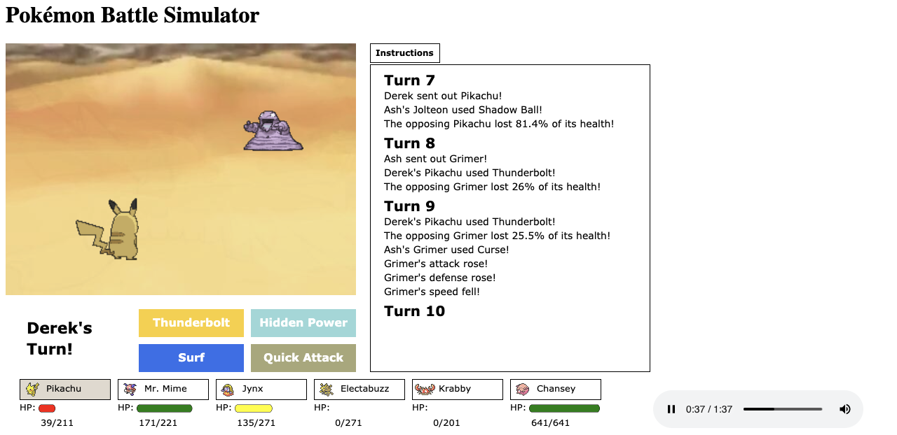

# Pokemon Battle Simulator
This [Pokemon Battle Simulator](https://pokemon-battle-simulator.netlify.com/) is a browser game implemented using vanilla Javascript and the HTML5 Canvas API.


## Instructions
The Pokemon Battle Simulator randomly generates two teams of six Pokemon. Players take turns either selecting a move with which to attack or a Pokemon to switch in. Text commentary is shown on the right side. Play continues until all of one player's Pokemon have fainted, at which point a winner is declared!




## Technical Challenge
The first challenge in building this game was in animating all of the Pokemon. This problem was solved by downloading GIFs, splitting them into frames, and then looping over each frame by using requestAnimationFrame. Since each Pokemon's animation differed in length, the animation loop also differs for each Pokemon and is reset when a new Pokemon is switched in.
```
drawPokemon(){
    // get image sources for the pokemon
    let frontPokemon = new Image();
    frontPokemon.src = this.src1[this.currentLoopIndex1];
    let backPokemon = new Image();
    backPokemon.src = this.src2[this.currentLoopIndex2];

    backPokemon.onload = () => {
      if (!this.paused){
        // frameCount used for animation
        this.frameCount++;

        if (this.frameCount > 1) {
          // clear battle screen
          this.ctx.clearRect(0, 0, positionData['backgroundWidth'], positionData['backgroundHeight'] + 10);

          this.drawBackground(this.background);
          let pokemon1 = 'front' + this.firstPoke1;
          let pokemon2 = 'back' + this.firstPoke2;

          // positional data is stored in a separate file and referenced here
          this.ctx.drawImage(frontPokemon, pokemonData[pokemon1]['x'], pokemonData[pokemon1]['y'], pokemonData[pokemon1]['width'], pokemonData[pokemon1]['height']);
          this.ctx.drawImage(backPokemon, pokemonData[pokemon2]['x'], pokemonData[pokemon2]['y'], pokemonData[pokemon2]['width'], pokemonData[pokemon2]['height']);
          this.currentLoopIndex2++;

          // reset animation counters
          if (this.currentLoopIndex2 >= this.cycleLoop2.length) {
            this.currentLoopIndex2 = 0;
          }
          this.currentLoopIndex1++;
          if (this.currentLoopIndex1 >= this.cycleLoop1.length) {
            this.currentLoopIndex1 = 0;
          }
          this.frameCount = 0;
        }
      }
      window.requestAnimationFrame(() => this.drawPokemon());
    }
  }
```

Another challenge that emerged was in implementing the turn loop. The turn loop in Pokemon is rather complex:

* Switches are done before attacks.
* If both Pokemon are switched out, the one with faster speed switches first.
* If both Pokemon attack, the one with faster speed attacks first.
* If the slower Pokemon faints, that Pokemon's user is immediately prompted to switch to a different Pokemon, and the move that was previously selected is canceled.
* In the event that the faster Pokemon's move does recoil damage, that Pokemon can also faint, and the user can be prompted to switch to a different Pokemon.

A function to check if the current Pokemon has fainted was built and ran after each turn loop. By default, it checks the opposing Pokemon relative to the one that just attacked, but can also check the attacking Pokemon in the case of recoil damage. If the function returns true (indicating that a Pokemon has fainted), the user is given the option to switch to a different Pokemon.
```
checkFaint(faintPoke, player=null){
    // check if the pokemon's hp is 0
    if (faintPoke.currentStats['hp'] <= 0){
      let playerName = player ? player.name : this.currentPlayer.name;
      let message = playerName + "'s " + faintPoke.name + " fainted!";
      if (!this.messages["Turn " + this.turnCounter.toString()].includes(message)) this.messages["Turn " + this.turnCounter.toString()].push(message);
      
      // if that was the player's last pokemon, the game is over
      this.checkGameOver();

      if (faintPoke === this.player1.party[0]) this.currentPlayer = this.player1;
      
      // this statement interrupts the turn loop in the case of recoil damage causing a pokemon to faint
      if (player){
        this.currentPlayer = player;
      }

      // this faint flag will prevent the game from advancing to the next turn until a new pokemon is switched in
      this.currentPlayer.faint = true;

      // here the user is able to switch to a different pokemon
      this.drawOptionsDisplay();
      return true;
    }
    return false;
}
```

## Future Directions
* Attack animations/sounds
* Text commentary delay (so that the players can read the text line-by-line as they appear)
* More moves/Pokemon!
* Items/abilities